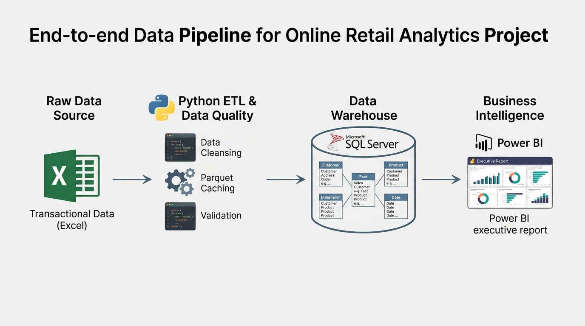
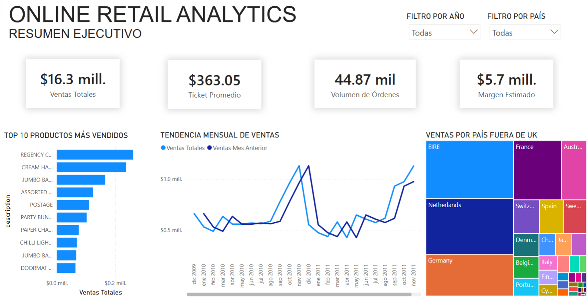
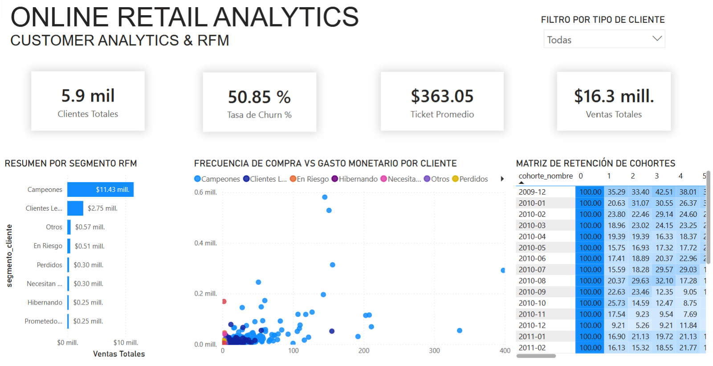

# 📃 Online Retail Analytics: End-to-End Data Engineering & BI 📊🛍️

<p align="center">
  
</p>

<p align="center">
   &nbsp;
   &nbsp;
   &nbsp;
   &nbsp;
   &nbsp;
</p>

## 📝 Descripción del Proyecto

Este proyecto implementa una solución analítica integral para procesar y analizar transacciones comerciales de retail electrónico. El flujo de trabajo abarca desde la ingesta y perfilado de datos crudos hasta la creación de un Data Mart dimensional y la construcción de paneles ejecutivos de inteligencia de negocios.

A través de un pipeline modular, se identifican y corrigen anomalías en los registros transaccionales, se modela un esquema estrella bajo la metodología de Ralph Kimball en Microsoft SQL Server, se calculan segmentaciones de clientes mediante SQL analítico avanzado y se exponen los resultados en Power BI.

---

## 📦 Fuente de Datos

El conjunto de datos utilizado corresponde al estándar de la industria **Online Retail II Data Set**, obtenido a través de Kaggle:

* **Origen**: [Online Retail Dataset en Kaggle](https://www.kaggle.com/datasets/lakshmi25npathi/online-retail-dataset?resource=download)
* **Archivo original**: `online_retail_II.xlsx`
* **Volumen**: 1,067,371 filas distribuidas en dos hojas correspondientes a los periodos 2009-2010 y 2010-2011.
* **Atributos**: `Invoice`, `StockCode`, `Description`, `Quantity`, `InvoiceDate`, `Price`, `Customer ID` y `Country`.
* **Peso aproximado**: 45.6 MB.

Por buenas prácticas de ingeniería de software y control de versiones, los archivos de datos pesados no se almacenan en este repositorio. Para ejecutar el proyecto localmente, descargue el archivo desde el enlace indicado y colóquelo en la raíz del proyecto.

---

## 🏛️ Arquitectura de la Solución

El flujo de datos sigue cuatro etapas secuenciales:

1. **Ingesta y Perfilado de Datos**: Extracción desde hojas de cálculo, consolidación en memoria y almacenamiento intermedio en formato Parquet para reducir tiempos de lectura.
2. **Transformación y Limpieza**: Normalización de nombres de columnas, eliminación de registros duplicados, exclusión de transacciones sin identificación de cliente y aislamiento de facturas canceladas.
3. **Data Mart Dimensional**: Construcción de un esquema estrella con claves subrogadas enteras para optimizar uniones relacionales e inserción masiva en base de datos relacional.
4. **Capa Analítica y Presentación**: Consultas T-SQL para análisis RFM y retención de cohortes, conectadas a un reporte interactivo de dos páginas en Power BI.

---

## 📁 Estructura del Repositorio

```text
online-retail-analytics/
├── .env.example              # Plantilla de variables de entorno para la base de datos
├── .gitignore                # Exclusión de archivos de datos pesados y credenciales
├── requirements.txt          # Dependencias del entorno de ejecución de Python
├── etl_pipeline.py           # Pipeline ETL modular en Python
├── post/
│   ├── pipeline.png          # Diagrama visual de la arquitectura
│   └── screenshots/          # Capturas de pantalla del reporte en Power BI
│       ├── 01_resumen_ejecutivo.png
│       └── 02_customer_analytics_rfm.png
├── power_bi/
│   ├── README.md             # Directorio para alojar el archivo de Power BI (.pbix)
│   └── dax_measures.md       # Diccionario de medidas DAX y capa semantica
└── sql/
    ├── 01_constraints_and_indexes.sql  # Definición de llaves primarias, foráneas e índices
    ├── 02_rfm_segmentation.sql         # Segmentación de clientes mediante modelo RFM
    └── 03_cohort_retention.sql         # Matriz de retención de cohortes mensual
```

---

## ⚙️ Fases de Implementación

### Fase 1: Pipeline ETL y Auditoría de Calidad en Python

El archivo `etl_pipeline.py` implementa funciones dedicadas para cada etapa del procesamiento:

* **Auditoría de Datos**: Detección sistemática de valores nulos, registros con precios menores o iguales a cero, transacciones con cantidades negativas y duplicados exactos.
* **Optimización con Parquet**: Consolidación de hojas anuales y persistencia en disco mediante PyArrow, reduciendo el tiempo de carga subsecuente a menos de un segundo.
* **Reglas de Negocio**:
  * Filtrado de registros sin código de cliente para mantener la integridad de métricas individuales.
  * Creación de un indicador booleano para identificar cancelaciones y devoluciones.
  * Cálculo de la métrica de fila correspondiente al importe total.
  * Generación de claves subrogadas enteras para las dimensiones.

### Fase 2: Modelado Dimensional en SQL Server

Se estructura un Data Mart en esquema estrella compuesto por las siguientes entidades:

* **Fact_Ventas**: Tabla de hechos con métricas de cantidad, precio unitario, importe total, indicador de cancelación y referencias foráneas a todas las dimensiones.
* **Dim_Cliente**: Atributos únicos por cliente y país de procedencia.
* **Dim_Producto**: Catálogo maestro de artículos con código comercial y descripción estandarizada.
* **Dim_Tiempo**: Dimensión de fecha generada con granularidad diaria, identificador entero en formato cronológico, número de mes, nombre de mes, trimestre y día de la semana.
* **Dim_Geografia**: Relación territorial normalizada de los mercados de venta.

El script `sql/01_constraints_and_indexes.sql` aplica restricciones de integridad referencial e índices no agrupados en las columnas clave para acelerar las operaciones de filtrado y agregación.

### Fase 3: Consultas Analíticas Avanzadas en T-SQL

* **Segmentación RFM (`sql/02_rfm_segmentation.sql`)**: 
  Calcula para cada cliente la recencia en días, la frecuencia de compras distintas y el valor monetario acumulado. Mediante la función de ventana `NTILE(5)` se dividen los clientes en quintiles objetivos, clasificándolos en categorías estratégicas como Campeones, Clientes Leales, En Riesgo o Perdidos. Los resultados se encapsulan en la vista `vw_segmentacion_rfm`.

* **Matriz de Cohortes de Retención (`sql/03_cohort_retention.sql`)**: 
  Determina el mes de ingreso de cada cliente y calcula el porcentaje de retorno en los periodos posteriores. Se estructura en la vista `vw_retencion_cohortes` y genera la matriz triangular clásica de seguimiento de retención.

### Fase 4: Reporte Ejecutivo en Power BI

Las formulas analiticas de la capa semantica se encuentran documentadas en el [Diccionario de Medidas DAX](power_bi/dax_measures.md).

El informe visual consta de dos páginas diseñadas para diferentes niveles de decisión:

#### 1. Resumen Ejecutivo de Ventas y Márgenes

Permite evaluar el desempeño comercial general, monitorear el cumplimiento de metas y analizar la concentración de ventas geográficas y de producto.

<p align="center">
  
</p>

* Tarjetas de resumen con ventas totales, ticket promedio, volumen de órdenes y margen operativo estimado.
* Gráfico de líneas temporal con comparación de ventas respecto al mes anterior mediante funciones DAX de inteligencia de tiempo.
* Gráfico de barras con los artículos de mayor volumen de venta.
* Treemap de distribución geográfica de facturación en mercados externos.

#### 2. Customer Analytics y Segmentación RFM

Enfocado en la salud de la cartera de clientes, patrones de recurrencia y mitigación de abandono.

<p align="center">
  
</p>

* Indicadores clave de recuento total de clientes y tasa de abandono de compras superiores a noventa días.
* Gráfico de dispersión cruzando frecuencia de compra contra gasto total por cliente, clasificado por segmento RFM.
* Gráfico de barras de contribución monetaria por categoría de cliente.
* Matriz de calor con la tasa porcentual de retención por cohorte mensual.

---

## 🚀 Guía de Ejecución

### 1. Requisitos Previos

* Python 3.10 o superior
* Microsoft SQL Server local o remoto
* ODBC Driver 17 o 18 for SQL Server
* Microsoft Power BI Desktop

### 2. Instalación del Entorno

Clonar el repositorio y configurar el entorno virtual:

```bash
git clone https://github.com/DranxFa/online-retail-analytics.git
cd online-retail-analytics

python -m venv .venv
source .venv/Scripts/activate  # En Windows PowerShell: .venv\Scripts\Activate.ps1
pip install -r requirements.txt
```

### 3. Descarga del Conjunto de Datos

Descargue el archivo `online_retail_II.xlsx` desde [Kaggle](https://www.kaggle.com/datasets/lakshmi25npathi/online-retail-dataset?resource=download) y ubíquelo en el directorio raíz del proyecto.

### 4. Configuración de Variables de Entorno

Crear el archivo `.env` a partir de la plantilla proporcionada e ingresar las credenciales de conexión:

```bash
cp .env.example .env
```

Editar `.env` con los valores correspondientes al servidor local:

```env
DB_SERVER=localhost
DB_NAME=OnlineRetailDW
DB_USER=sa
DB_PASSWORD=tu_password_aqui
```

### 5. Creación de la Base de Datos y Ejecución del Pipeline

Crear la base de datos en SQL Server Management Studio:

```sql
CREATE DATABASE OnlineRetailDW;
GO
```

Ejecutar el script principal de extracción, transformación y carga:

```bash
python etl_pipeline.py
```

### 6. Aplicación de Scripts SQL

Abrir y ejecutar en SQL Server Management Studio los scripts contenidos en la carpeta `sql/` en el orden indicado:

1. `sql/01_constraints_and_indexes.sql`
2. `sql/02_rfm_segmentation.sql`
3. `sql/03_cohort_retention.sql`

### 7. Carga en Power BI Desktop

Abrir Power BI Desktop, conectar al servidor de SQL Server en la base de datos `OnlineRetailDW` en modo Importar, seleccionar las dimensiones, la tabla de hechos y las vistas analíticas, y abrir el archivo `.pbix` ubicado en la carpeta `power_bi/`.

---

## 👤 Autor

| [<br><sub>Andrio Contreras</sub>](https://github.com/DranxFa) |
| :---: |

---

## 📌 Estado del Proyecto

✅ **Finalizado** — Proyecto con fines educativos.
